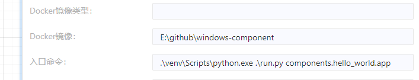
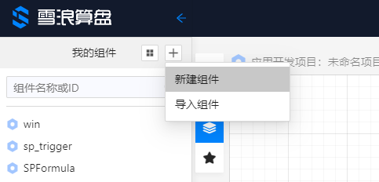
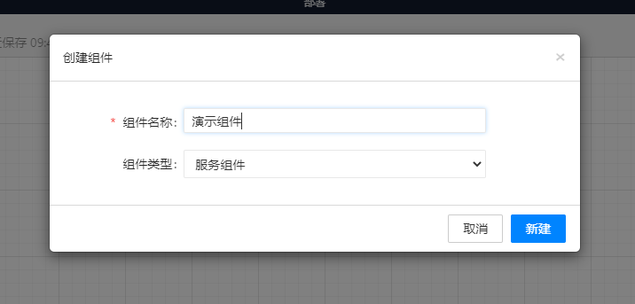
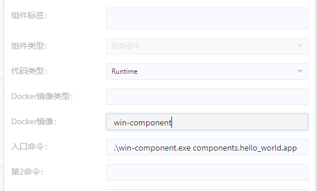
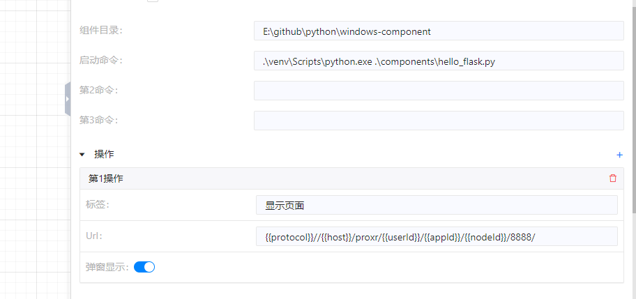

# Windows 版算盘组件制作

本项目演示一个简单的 Windows 版算盘组件的制作。与 web 版组件的主要区别是运行环境和打包方式的不同。web 版组件运行在 Linux 环境下，由 docker 打包成镜像；Windows 版组件运行在 win 环境下，使用 python venv 隔离环境。

参考项目地址：https://github.com/8i5dev/windows-component

## 解决组件 Windows 依赖

最新版的算盘 python sdk `suanpan-core` 支持 python 3.7 ~ 3.9，同时支持 Linux 和 Windows 环境。`suanpan-core` 默认删减了输入输出 Table 类型的支持，这使得 `suanpan-core` 能够支持不同的操作系统环境，和支持更高的 python 版本。如果需要 Table 类型，可以通过 `pip install suanpan-core[table]`命令安装，但其支持的环境和 python 版本受限于 Table 类型需要的依赖库。

如果新开发 Windows 环境的组件，选择能够支持 Windows 环境的依赖，一般 python 库都能支持。如果要迁移已经运行于云端算盘的组件，确保所有组件的 python 依赖包能够在 Windows 下运行。如果有的包没有 win 环境的包，请用其他类似包代替。

## Windows 环境开发调试和打包

算盘客户端默认会在其安装路径下的 components 目录下查找并启动组件。

如果是个人开发使用，你可以将算盘的组件路径设置到本地的项目地址，配置入口命令之后即可运行组件，这样比较方便开发调试。如果你想把组件放到其他机器的算盘上使用，推荐使用 pyinstaller 打包成 exe 文件。

### 虚拟环境

为了防止不同组件之间 python 依赖的冲突，我们采用 python venv 来制作 Windows 环境下的组件。你可以使用自己已有的环境，也可以由 IDE 自动生成虚拟环境。如果你要自己手动创建虚拟环境，执行以下命令。创建完虚拟环境之后，请安装所需 python 依赖。

```powershell
# 进入组件目录
cd .\windows-component\
# 创建虚拟环境
python.exe -m venv --copies venv
# powershell 进入虚拟环境
.\venv\Scripts\activate.ps1
# 安装依赖包 （请确保组件所需依赖已加入requirements.txt,参考“解决组件 Windows 依赖”）
pip install -r .\requirements.txt
```

### 本地运行调试

如果仅在本地算盘运行和调试，可以在算盘中添加组件并如下设置：

```shell
# 组件目录:
E:\github\windows-component
# 启动命令:
.\venv\Scripts\python.exe .\run.py components.hello_world.app
# 或者:
.\venv\Scripts\python.exe components.hello_world.py
```



`Docker镜像`中填入项目的绝对路径，`入口命令`中填入执行的命令。

### pyinstaller 打包

如果要将组件给其他算盘运行，需要用 pyinstaller 打包，这样可以将组件变成一个可执行程序，同时项目加密代码。

1. 首先安装 pyinstaller；
   
   ```powershell
   # powershell 进入虚拟环境
   .\venv\Scripts\activate.ps1
   # 升级pip和setuptools到最新的版本
   easy_install -U pip
   pip install -U setuptools
   # 安装 pyinstaller
   pip install pyinstaller
   ```

2. **确保** run.py 文件里 `import components`，这能让 pyinstaller 自动发现 components 中的文件；

3. 然后使用下面的命令把组件打包成一个 Windows 环境能直接运行的文件包，-n 参数是最终生成的 exe 名字。
   
   ```powershell
   pyinstaller --additional-hooks-dir hooks --clean run.py -n win-component
   ```

## 组件添加到算盘

组件制作完成之后，将 dist 下的 win-component 目录复制到单机版算盘的 components 目录下。然后在算盘界面中加入组件。

1. 点击左侧 + 号新建组件



2. 输入组件名称



3. 运行程序

在右侧 `Docker镜像` 栏输入 `win-component`，然后在 `入口命令` 栏输入 `.\win-component.exe components.hello_world.app`。



保存之后组件就新建完成了。

4. 组件页面

如果组件带有前端页面，在右面板操作栏配置。如下图示例，在第1操作标签栏填写标签名称，在 Url 栏填写组件前端服务的算盘访问地址 `{{protocol}}//{{host}}/proxr/{{userId}}/{{appId}}/{{nodeId}}/8888/`，其中 8888 是 sdk 默认的 web 服务逻辑地址，如果使用的是自己定义的服务，对应修改。



## 组件页面开发

带前端页面的组件开发与与正常的前端开发一样，唯一要注意的区别是前端引用的静态文件地址不能以 ‘/’ 开头。由于在算盘中访问组件页面是通过算盘的代理地址转发，如果是如下静态文件地址，在算盘中显示的组件页面会产生问题。

```html
    <link rel="stylesheet" href="/static/css/bootstrap.min.css">
    <link rel="stylesheet" href="/static/css/style.css">
    <link rel="stylesheet" href="/static/css/toastr.min.css">
```

需要修改成下面的样子：

```html
    <link rel="stylesheet" href="static/css/bootstrap.min.css">
    <link rel="stylesheet" href="static/css/style.css">
    <link rel="stylesheet" href="static/css/toastr.min.css">
```

## 注意事项

1. 算盘 python sdk 请使用 `suanpan-core`，它能支持更高的 python 版本。原`python-suanpan` 也会同步更新，但不推荐使用，因为其依赖太多，使用环境受比较多的限制。
2. 在requirement.txt中添加依赖时，最好固定依赖的版本。避免由于版本更新导致的不可用问题。
